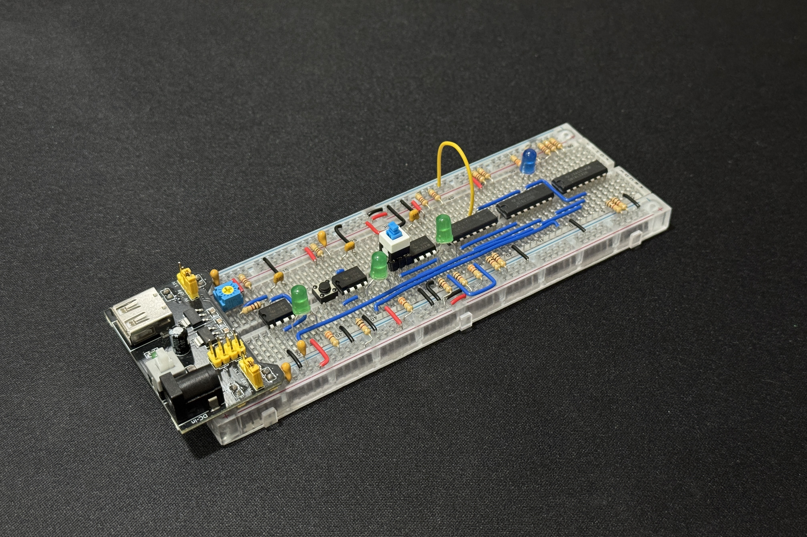
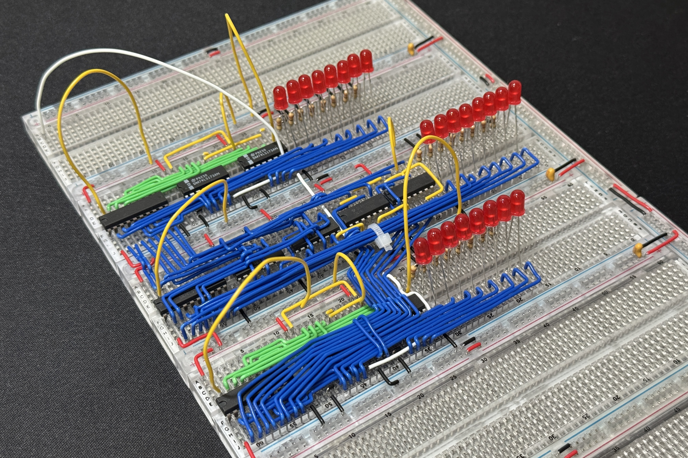
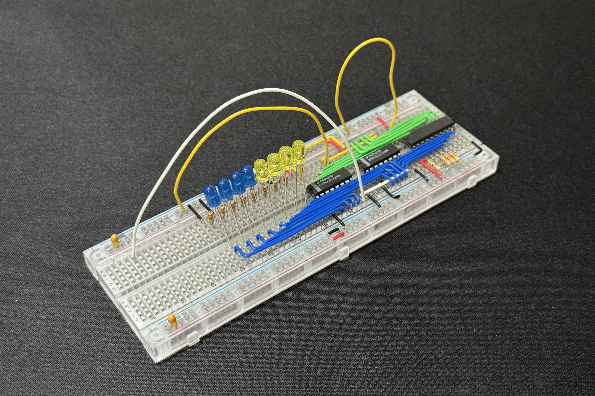

# SAP-1 8-bit Breadboard Computer

SAP-1 (Simple As Possible - 1) is a fully functional 8-bit computer built entirely from scratch using basic logic chips and breadboards. My version is based on Ben Eater's design with power distribution changes along with IC placement and wiring differences.

The computer works without any code and can be manually programmed by using DIP switches and Arduino code is used to program EEPROM lookup tables so numbers can be displayed properly. More complex programs such as multiplication or sequencing are written in Assembly and manually entered via DIP switches.

## Core Components

**CPU Architecture**
- **A Register (Accumulator) -** The main register that stores data for math operations
- **B Register -** The secondary register to hold the second operand for ALU operations
- **Arithmetic Logic Unit (ALU) -** Does the addition and subtraction
- **Instruction Register -** Stores the current instruction being executed
- **Program Counter -** Keeps track of which instruction to execute next

**Memory & I/O**
- **16-byte RAM -** Stores both the program instructions and data
- **4-bit address -** Can access 16 memory locations (can store either instructions or data)
- **7-segment display -** Decimal display for output
- **Control switches -** Includes DIP switches and buttons for manual programming

## Instruction Set

I've programmed a complete instruction set in the [CPU microcode](./programs/sap1_cpu_microcode/sap1_cpu_microcode.ino)
- **NOP -** No operation
- **LDA -** Load from memory to A register
- **ADD -** Add memory to A register
- **SUB -** Subtract memory from A register
- **STA -** Store A register to memory
- **LDI -** Load immediate value to A register
- **JMP -** Jump to address
- **OUT -** Output A register to display
- **HLT -** Halt computer

## Operation Cycle

1. **Fetch -** The program counter addresses memory, then instruction is loaded into the instruction register
2. **Decode -** Control logic interprets the opcode to figure out which operation to perform
3. **Execute -** The control signals are activated to do the instruction
4. **Increment -** If there's no jump, the program counter advances to the next instruction

## Programming

**SAP-1 Programs**
- Programs (like multiplication, Fibonacci sequence, etc.) are written in Assembly and manually entered via DIP switches into the RAM

**Display Setup**
- [Arduino EEPROM programmers](./programs/sap1_decimal_counter_programmer/sap1_decimal_counter_programmer.ino) are used to prepare lookup tables for decoding the 7-segment display

**Example Programs**
- I put the [Assembly examples](./programs/assembly/) in the Assembly folder

<!-- 🎥 [Watch the demo video](LINK) 🎥 -->

## This project is not finished yet, but here are some WIP images

