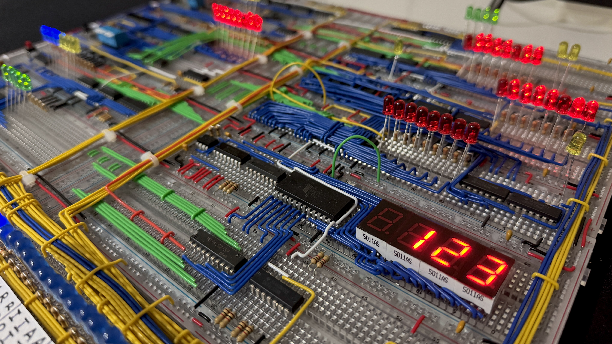
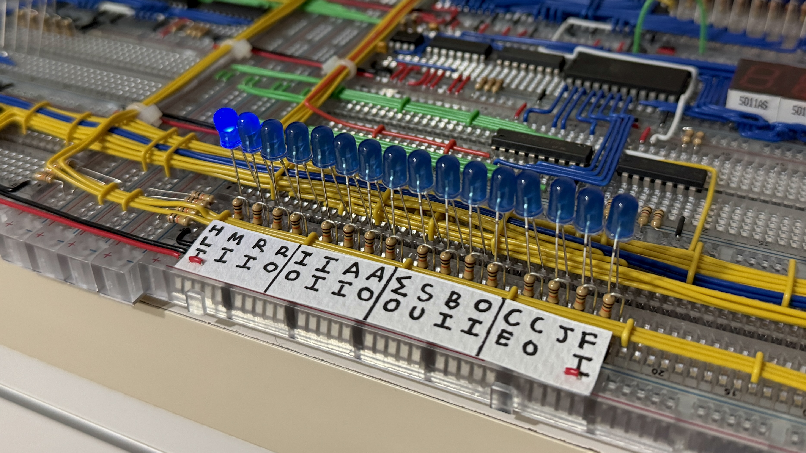
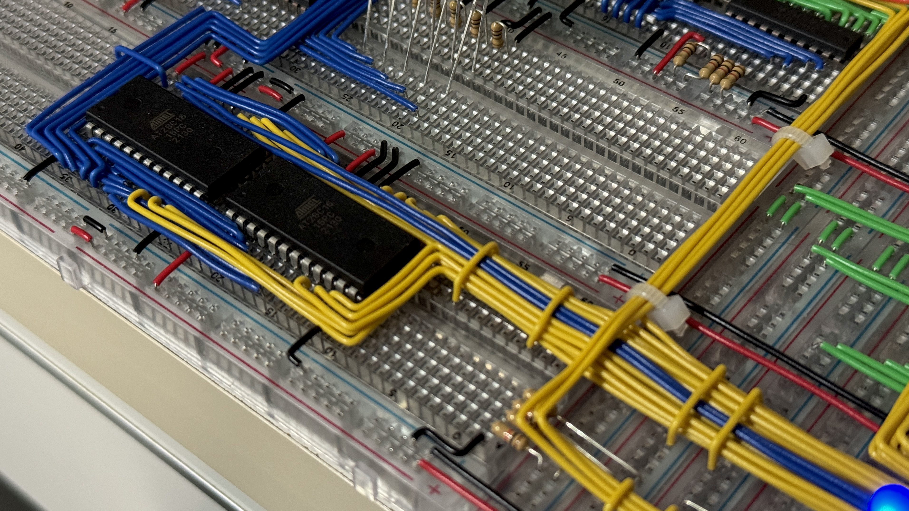
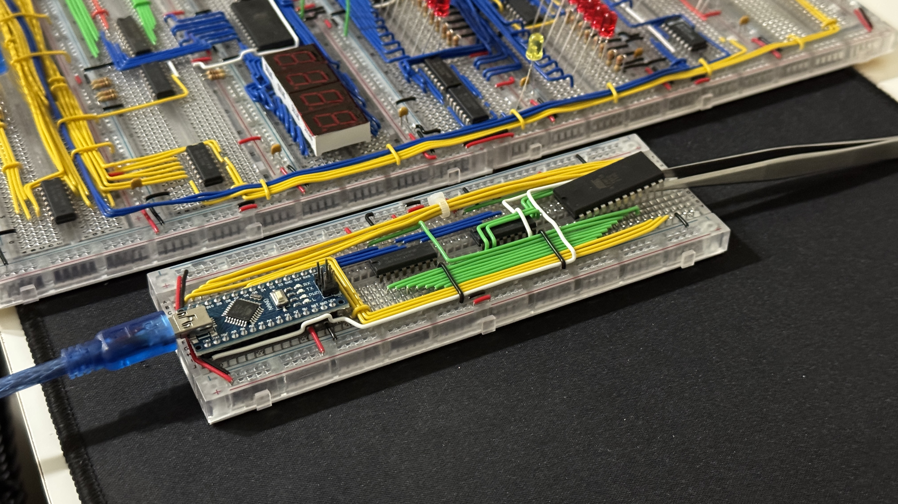
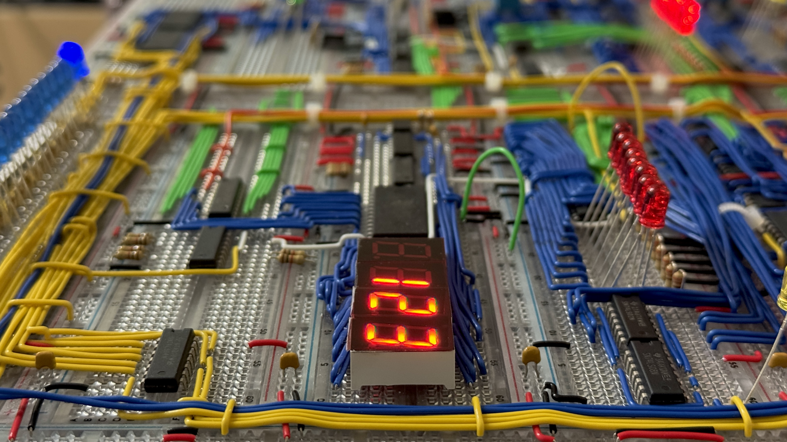
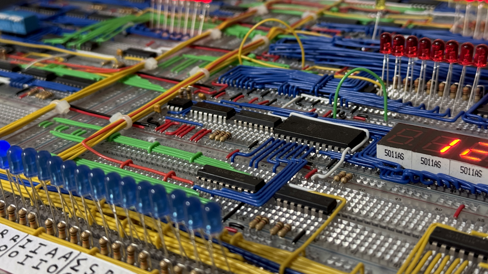
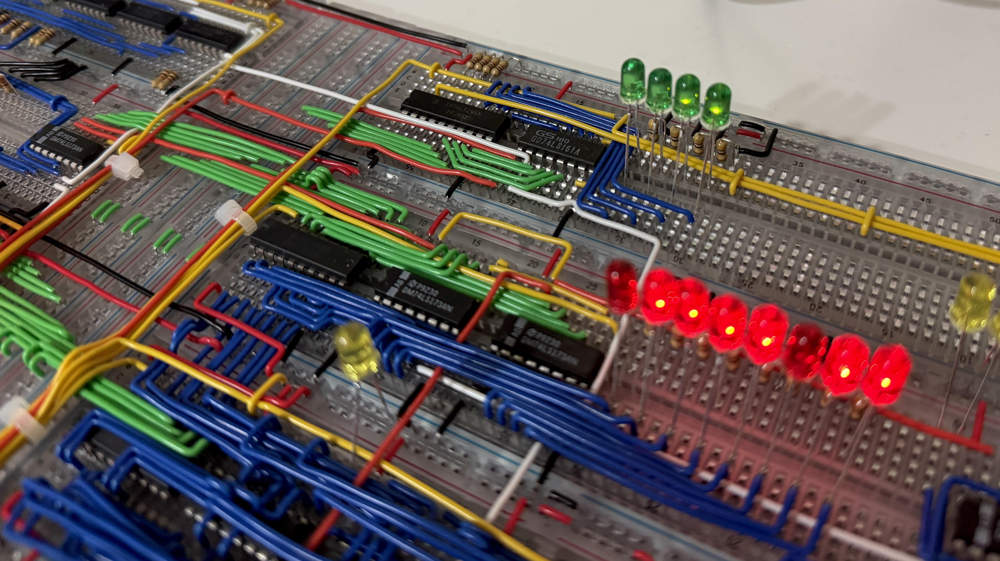

# SAP-1 8-bit Breadboard Computer

[](https://en.wikipedia.org/wiki/Assembly_language)
[](https://isocpp.org/)
[](https://www.arduino.cc/)
[]()

SAP-1 (Simple As Possible - 1) is a fully functional 8-bit computer built entirely from scratch using basic logic chips and breadboards. My version is based on Ben Eater's design with power distribution changes along with IC placement and wiring differences.

The computer works without any code and can be manually programmed by using DIP switches. Arduino code is used to program EEPROM lookup tables so numbers can be displayed properly. More complex programs such as multiplication or sequencing are written in Assembly and manually entered via DIP switches.

🎥 [Demo video](https://www.youtube.com/shorts/4pfi_eUA4II) // [Countdown](https://youtu.be/wu7tkiY4CAg) // [Powers of 2](https://www.youtube.com/watch?v=veCdd8PZPOk) // [Multiples of 3](https://youtu.be/clsH6ASg8Kw) 🎥


| Sections  |
|-----------|
| 🔧 [Core Components](#core-components) |
| 📊 [Instruction Set](#instruction-set) |
| ⚡ [Operation Cycle](#operation-cycle) |
| 💻 [Programming](#programming) |
| 📸 [Images](#images) |

## Core Components

**CPU Architecture**
- **A Register (Accumulator) -** The main register that stores data for math operations
- **B Register -** The secondary register to hold the second operand for ALU operations
- **Arithmetic Logic Unit (ALU) -** Does the addition and subtraction
- **Instruction Register -** Stores the current instruction being executed
- **Flags Register -** Checks for overflow or underflow values
- **Program Counter -** Keeps track of which instruction to execute next
- **EEPROM Programmer -** For CPU microcode & display programming

**Memory & I/O**
- **16-byte RAM -** Stores both the program instructions and data
- **4-bit address -** Can access 16 memory locations (can store either instructions or data)
- **7-segment display -** Decimal display for output
- **Clock control -** Includes a potentiometer for controlling clock speed along with the option to set the clock to automatic or manual
- **Reset button -** Includes a button to reset the computer and rerun any loaded programs
- **Control switches -** Includes DIP switches and buttons for manual programming

## Instruction Set

I've programmed a complete instruction set in the [CPU microcode](./programs/sap1_cpu_microcode/sap1_cpu_microcode.ino)
```text
0000    NOP - No operation
0001    LDA - Load from memory to A register
0010    ADD - Add memory to A register
0011    SUB - Subtract memory from A register
0100    STA - Store A register to memory
0101    LDI - Load immediate value to A register
0110    JMP - Jump to address
0111    JC  - Jump if carry (overflow)
1000    JZ  - Jump if zero  (underflow)
1110    OUT - Output A register to display
1111    HLT - Halt computer
```

For info on how to input the assembly program, look at [Programming](#programming)

## Operation Cycle

1. **Fetch -** The program counter addresses memory, then instruction is loaded into the instruction register
2. **Decode -** Control logic interprets the opcode to figure out which operation to perform
3. **Execute -** The control signals are activated to do the instruction
4. **Increment -** If there's no jump, the program counter advances to the next instruction

## Programming

**SAP-1 Programs**
- Programs (like multiplication, powers of 2, etc.) are written in Assembly and manually entered via DIP switches into the RAM

```text
Manual Programming Instructions

1. Switch to the memory address you want to program the instruction on
2. Input the instruction opcode (first 4 bits) and the operand/target address (last 4 bits)
3. For data storage locations, just input the 8-bit binary value directly

Examples: 
Load number from address 15: 0001 1111
Output:                      1110 0000
Jump to address 3:           0110 0011
Data storage (123):          0111 1011
```

**Display Setup**
- [Arduino EEPROM programmers](./programs/sap1_decimal_counter_programmer/sap1_decimal_counter_programmer.ino) are used to prepare lookup tables for decoding the 7-segment display

**Example Programs**
- [Assembly examples](./programs/assembly/) are in the Assembly folder

## Images







